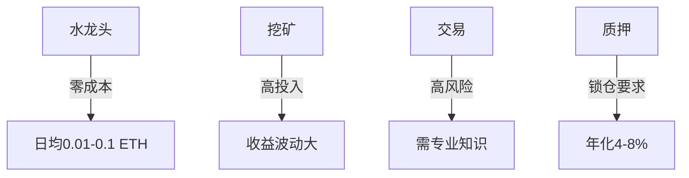

# 以太坊水龙头推荐：2025年最新免费获取ETH的渠道

## 以太坊水龙头运作原理详解

以太坊作为全球第三大主流加密货币，自2015年由Vitalik Buterin推出以来，凭借智能合约和DApp生态系统的创新优势，已发展出完整的区块链生态。对于普通用户而言，除了常规交易和挖矿外，**以太坊水龙头（Faucet）** 成为获取基础ETH的有效途径。

所谓水龙头机制，本质是通过参与平台广告流量变现，向用户发放小额ETH奖励。这种模式已发展为加密货币领域的经典获客方式，其核心价值在于：

1. 用户通过完成验证码验证、广告浏览等简单任务
2. 平台根据流量收益按比例分配ETH奖励
3. 多平台矩阵操作可实现收益叠加

## 2025年精选以太坊水龙头平台

以下是经过严格筛选的可信平台（数据更新至2025年3月）：

| 平台名称       | 单次最高奖励 | 领取频率 | 最低提现额 | 特色功能                |
|----------------|--------------|----------|------------|-------------------------|
| freethereum.com | 0.93 ETH     | 每小时    | 0.005 ETH  | 智能合约奖励池          |
| Faucetcrypto    | 数百广告任务 | 每30分钟  | 无门槛     | 多链资产支持            |
| CoinPayu        | 动态奖励     | 每小时    | 0.0001 ETH | 18种加密货币即时兑换    |
| Faucetpay       | 每日随机奖励 | 多链支持  | 无门槛     | 奖励竞猜游戏系统        |

👉 [立即体验高收益水龙头平台](https://bit.ly/okx_welcome)

## 水龙头收益获取全流程指南

### 第一步：建立数字钱包体系
建议采用多层架构：
- 主钱包（如MetaMask）：存储大额资产
- 微支付钱包（CoinPot/FaucetPay）：对接水龙头
- 交易所钱包：用于快速变现

### 第二步：优化任务执行策略
1. 使用浏览器收藏夹建立「水龙头任务组」
2. 设置每小时提醒循环访问
3. 优先完成高价值任务（如视频广告）
4. 利用移动端APP实现碎片化操作

### 第三步：收益管理技巧
- 设置自动提现阈值
- 建立收益追踪表格
- 定期进行跨平台资产整合
- 关注平台限时加奖活动

## 常见问题解答（FAQ）

### Q：水龙头收益是否具有可持续性？
A：当前主流平台年化收益约0.5-2 ETH（视市场行情波动），建议作为数字资产入门积累方式，配合定投策略效果更佳。

### Q：如何防范水龙头诈骗？
A：重点关注三点：
1. 是否要求预付手续费
2. 奖励发放延迟是否超过72小时
3. 是否强制要求邀请下线

👉 [获取官方认证水龙头名单](https://bit.ly/okx_welcome)

### Q：微支付钱包的安全性如何保障？
A：推荐选择开源项目（如CoinPot）并启用：
- 两步验证（2FA）
- 邮件确认机制
- 多设备登录提醒

## 水龙头经济模型深度解析

### 收益构成要素
| 影响因素       | 权重占比 | 优化建议                 |
|----------------|----------|--------------------------|
| 平台活跃度     | 40%      | 每日保持5次以上交互      |
| 任务完成质量   | 30%      | 优先完成视频类高价值任务 |
| 钱包系统匹配度 | 20%      | 选择主流钱包协议兼容平台 |
| 市场行情波动   | 10%      | 低点积累，高点分批变现   |

### 与其他获取方式对比

👉 [查看实时ETH收益计算器](https://bit.ly/okx_welcome)

## 水龙头使用进阶策略

### 多平台联动技巧
1. 建立跨平台任务日历
2. 利用不同平台奖励周期差异
3. 参与平台间联合推广活动

### 数据追踪与分析
建议使用Google Sheets建立收益看板，包含以下维度：
- 平台名称
- 每日收益（ETH）
- 累计收益
- 提现记录
- 任务耗时统计

## 2025年水龙头发展趋势

随着EIP-1559升级和Layer2生态的完善，新一代水龙头呈现以下特点：
1. 奖励结构通缩化（Gas费抵扣）
2. NFT任务融合（完成度奖励）
3. DAO治理机制引入